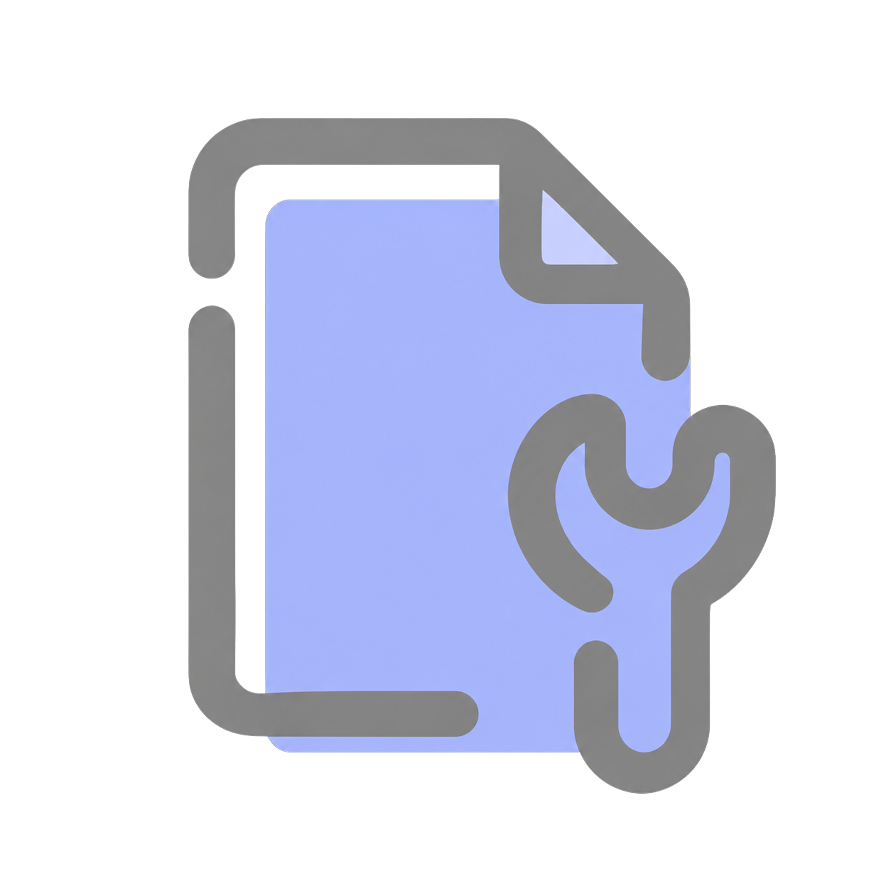

<p align="center">
  
</p>

# EchoHands

EchoHands is a modular AI-powered framework for real-time sign language recognition using a webcam. It provides a structured pipeline for detecting hand gestures, processing hand landmarks, recognizing signs, and converting them into digital text
The Application currently focuses on American Sign Language (ASL) and serves as a working foundation for further development, experimentation, and adaptation to other sign languages and recognition systems

---

<div align="center">

📦 **[Get the Latest Model Configuration File →](#-model-configuration-file)**  
 Keep your Model Configuration File up to date for the latest released models 
 (Download the file and paste it into the application root directory. If prompted, select "Replace" to overwrite the existing file)

</div>

---

## ⚙️ Technology & Working

- Webcam Capture: Capture real-time video using ***OpenCV***
- Hand Detection: Detect hands and extract 21 landmarks using ***MediaPipe***
- Feature Processing: Process landmark data into model-ready features using ***NumPy***
- Static Recognition: Recognize static signs using a scikit-learn Random Forest model
- Dynamic Recognition: Analyze multi-frame hand movements using a ***TensorFlow/Keras*** LSTM model
- Recognition Control: Check and filter model predictions before accepting them, ensuring a gesture is recognized only when it is reliable and preventing the same held gesture from being added repeatedly.
- Text Output: Build recognized signs into digital text through the application's text-building module

---

# Installation & Requirements

### Recommended Python Version

Application is recommended to run with:

```text
Python 3.10
```

Using Python 3.10 helps maintain compatibility with the dependencies used by the Application

---


## 1. Clone the Repository

Open **Command Prompt** or **PowerShell** and run:

```bash
git clone https://github.com/shivanshu43/Echohands.git
cd EchoHands
```

> **Note:** The repository directory created by Git is `EchoHands_Alpha-build`. Use the directory name created on your system if it differs.

**Expected result:**

The repository is downloaded and the terminal moves into the Alpha Build project directory.

Your prompt should look similar to:

```text
E:\EchoHands_Alpha-build>
```

---


## 2. Create a Virtual Environment

The Application is recommended to use a Python 3.10 virtual environment.

### Windows

Run:

```bash
py -3.10 -m venv venv
```

**Expected result:**

The command normally produces no output and creates a new `venv` folder inside the project directory.

The project should now contain:

```text
EchoHands/
└── venv/
```

---


## 3. Activate the Virtual Environment

### Windows Command Prompt

Run:

```bash
venv\Scripts\activate
```

**Expected result:**

`(venv)` appears at the beginning of the command prompt:

```text
(venv) E:\EchoHands>
```

---


## 4. Verify Python

Confirm that the virtual environment is using the expected Python interpreter:

```bash
where python
```

The first path should point to the project's virtual environment, similar to:

```text
E:\EchoHands\venv\Scripts\python.exe
```

Then verify the Python version:

```bash
python --version
```

**Expected result:**

```text
Python 3.10.x
```

---


### Virtual Environment Troubleshooting

If you face an error related to the virtual environment, use the following recovery procedure.

#### Step 1 — Deactivate the Current Environment

Run:

```bash
deactivate
```

You should go from:

```text
(venv) E:\EchoHands_Alpha-build>
```

to:

```text
E:\EchoHands_Alpha-build>
```

---
#### Step 2 — Delete the Incorrect `venv`

Run:

```bash
rmdir /s /q venv
```

This removes the incorrectly created virtual environment.

---
#### Step 3 — Check Whether Python 3.10 Is Installed

Run:

```bash
py -0p
```

You should see something similar to:

```text
Installed Pythons found by py Launcher for Windows
 -3.13-64 ...
 -3.10-64 C:\...\Python310\python.exe
```

**We specifically need to see a 3.10 entry.**

You can also directly test:

```bash
py -3.10 --version
```

The expected result is:

```text
Python 3.10.x
```


### ► If `py -3.10 --version` Succeeds

Perfect. Now create the environment **only with this command**:

```bash
py -3.10 -m venv venv
```

> **Important:** Do not run `python -m venv venv` after this command. Doing so may recreate the environment using another installed Python version, such as Python 3.13.

Then activate it:

```bash
venv\Scripts\activate
```

Now verify:

```bash
python --version
```

You should get:

```text
Python 3.10.x
```

Then:

```bash
where python
```

The first result should be:

```text
E:\EchoHands_Alpha-build\venv\Scripts\python.exe
```

So the final verification should look approximately like:

```text
(venv) E:\EchoHands_Alpha-build>python --version
Python 3.10.x

(venv) E:\EchoHands_Alpha-build>where python
E:\EchoHands_Alpha-build\venv\Scripts\python.exe
...
```

---

### ► If `py -3.10 --version` Fails

If you get something like:

```text
Requested Python version (3.10) is not installed
```

then **Python 3.10 is not installed on your machine**, which is why another installed version such as Python 3.13 may be used.

In that case, do not create another `venv` yet.

Install **Python 3.10.x** first, then come back to:

```bash
py -3.10 -m venv venv
```

---


## 5. Upgrade pip

Run:

```bash
python -m pip install --upgrade pip
```

**Expected result:**

pip is upgraded successfully. The final output should contain a message similar to:

```text
Successfully installed pip-...
```

---


## 6. Install Dependencies

Install the following dependencies specified:

```bash
python -m pip install -r requirements.txt
```

**Expected result:**

pip downloads and installs the required packages.

The installation should finish with output similar to:

```text
Successfully installed ...
```

The exact dependencies and versions are defined in:

```text
requirements.txt
```

---


## 7. Verify the Model Configuration File
Unlike the Alpha Build, the Beta Build does not require the AI model files to be stored directly inside the project directory.
Instead, Beta uses a Model Configuration File to determine which tested model version should be used by the application.
Before launching EchoHands, make sure the following file is present in the project directory:

```text
EchoHands/
├── model_manifest.json
├── requirements.txt
├── README.md
├── Assets/
└── src/
```

The file should be named exactly:

`model_manifest.json`

>**Important:** Do not rename or manually edit `model_manifest.json`. EchoHands reads this file automatically when the application starts.
The Model Configuration File contains the information required by EchoHands to locate and verify the appropriate model package.

---


## 8. Launch EchoHands
Once the virtual environment is activated and the dependencies are installed, run:

```bash
python src/app.py
```

**Expected result:**
EchoHands starts and displays the startup screen.
On startup, EchoHands checks the Model Configuration File and prepares the required AI models.
* If the required models are already available in the local cache and are still valid, EchoHands can reuse them.
* If the models are not available locally or a newer model version is required, EchoHands retrieves the appropriate model package and stores it in the local model cache before starting recognition.

>**Note:** The first launch may take longer because EchoHands may need to prepare the required model files. Later launches can reuse the locally cached models when they are still valid.

---


## 9. Start Using EchoHands
After the startup process completes, the main EchoHands interface will appear.
Make sure your webcam is available and positioned so that your hand can be clearly detected.
You can then begin performing supported ASL signs.
For information about supported signs, keyboard controls, recognition behavior, and the Recognition Help panel, refer to the [**EchoHands User Manual**](#-user-manual).

---

## 📖 User Manual

<div align="center" style="border: 1px solid #d0d7de; border-radius: 8px; padding: 20px;">

<a href="EchoHands_User_Manual.pdf">
  
</a>

### [Open EchoHands User Manual](user_Manual.pdf)

Click the icon or the link above to open the complete User Manual.

</div>
---

---

## ⚠️ Issues you might face ;

<table>
<tr>
<td width="82%" valign="top">

### M / N — Landmark Jitter

- **M** and **N** may occasionally show unstable or jittery landmarks, which can result in lower model confidence.
- This can make these letters more difficult to register and may cause **M ↔ N** misrecognition.
- This is a known model issue and is planned for improvement in a future model version.

### K / U / V / R — Finger Tightness

Small differences in finger tightness and spacing can affect recognition between these similar-looking gestures.

- **K:** Keep the ring and pinky fingers relatively loose.
- **V:** Keep the ring and pinky fingers tightly folded.
- **U:** Keep the pinky tight, ring finger loose, thumb over the ring finger, and index + middle fingers joined. Otherwise, **U** may be recognized as **R**.
- **R:** Keep the index and middle fingers joined/crossed and avoid forming the **U** configuration.

### P — Minor Jitter

- **P** may occasionally show minor landmark jitter.
- Perform the gesture carefully and maintain a stable hand position. It should still recognize satisfactorily in most cases.

### Dynamic Recognition — Gesture Transitions

- When transitioning quickly between letters, the movement of your hand may occasionally trigger **dynamic gesture recognition**.
- This can happen while moving from one static letter to another, particularly when the transition resembles a supported dynamic gesture.
- In such cases, EchoHands may temporarily produce a dynamic prediction instead of the intended static letter.
- This can result in an incorrect letter being added to the word you are trying to create.

> **Tip:** When spelling a word, try to briefly stabilize your hand between letters and avoid unnecessary movement while transitioning between gestures. This gives the recognition pipeline a clearer gesture to process.

### General Recognition Tip

If a similar-looking letter is repeatedly misrecognized, first check your:

- Finger tightness
- Finger spacing
- Finger position
- Hand orientation
- Hand stability

Small changes in hand position or finger configuration can significantly affect recognition, especially for visually similar signs.


</tr>
</table>

<br>


<div align="left" style="border: 1px dashed #8b949e; border-radius: 10px; padding: 18px 20px;">


**Faced an issue, or did something not quite work as expected?**

I’m really sorry about that — thodi bohot mistakes toh reh hi jaati hain,,
I’ll surely work on fixing them!
If you find one, please help me catch those bugs playing hide-and-seek

<br>

**[🐛 Report a Bug](https://github.com/shivanshu43/Echohands/issues)** &nbsp;·&nbsp; **[💬 Join the Discussion](https://github.com/shivanshu43/Echohands/discussions)**

</div>

---


## 📦 Model Configuration File

Application uses a **Model Configuration File** to Setup latest released models for the application.

Whenever a new model version is released, make sure the latest Model Configuration File is present in your EchoHands application directory before launching the application

**Be sure to frequently check the GitHub repository to ensure you have the latest version of this file**

---

## 📦 Model Configuration File

EchoHands uses a Model Configuration File to Setup latest released models for the application

Whenever a new model version is released, make sure the latest Model Configuration File is present in your EchoHands application directory before launching the application

**Be sure to frequently check the GitHub repository to ensure you have the latest version of this file.**

<div align="center">

### ⬇️ Download Latest Model Configuration File

<a href="https://github.com/shivanshu43/Echohands/raw/refs/heads/main/model_manifest.json" download="model_manifest.json">
  
</a>

<br>

**`model_manifest.json`**

<br>

Click the icon above to download the latest Model Configuration File.

</div>

---
## 🚀 Future Development

**### Expanding to Other Sign Languages**

The current recognition pipeline can be adapted to other sign languages by collecting appropriate data, preparing language-specific datasets, and training suitable recognition models.

One important future direction is **Indian Sign Language (ISL)**.

The goal is not to assume that an ASL-trained model can directly recognize ISL. Instead, the existing EchoHands pipeline can serve as the technical foundation for building and training a separate recognition system using ISL-specific signs, datasets, labels, and models.

Conceptually:

```text

EchoHands Recognition Pipeline

            │
            ├── ASL Dataset + Models
            │        ↓
            │     ASL Recognition
            │
            └── ISL Dataset + Models
                     ↓
                  ISL Recognition

```

This makes EchoHands suitable for future expansion into a broader, modular sign-language recognition platform.

---

## Cloud-Based Recognition Architecture

The longer-term idea is to support a cloud or remote architecture where model inference is performed on infrastructure controlled by the project.

Instead of requiring every mobile device to run the complete recognition stack locally:

```text
Mobile Phone
      ↓
Camera / Recognition Input
      ↓
Remote or Cloud Service
      ↓
EchoHands Models
      ↓
Prediction
      ↓
Result Returned to Phone
```

This could make the mobile application lighter and make model updates easier to manage centrally.

The exact architecture is a future development goal and would require further work on networking, latency, privacy, security, scalability, and deployment.

---

## 👤 Author

**Shivanshu Khode**

[](mailto:shivanshukhode043@gmail.com)&nbsp;&nbsp;
[](https://www.linkedin.com/in/shivanshu-khode-a85343379)&nbsp;&nbsp;
[](https://www.instagram.com/shivanshu_khode/?hl=en)
